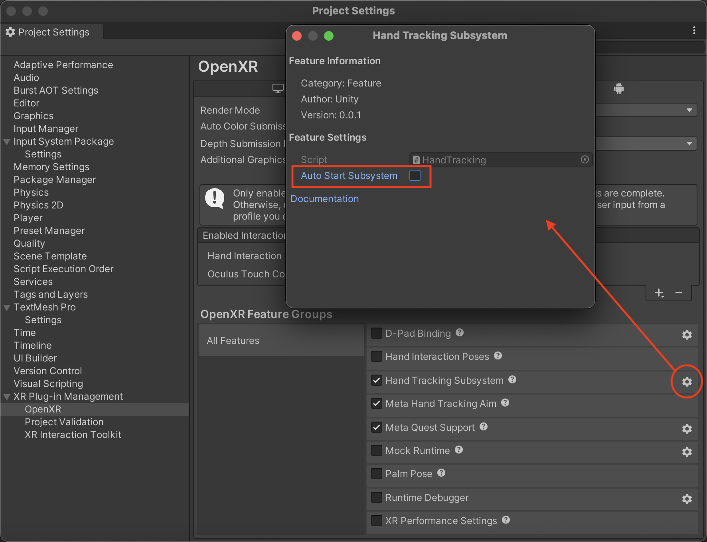

# Hand tracking OpenXR feature

Unity OpenXR provides support for the Hand Tracking extension specified by Khronos. Use this feature to have Unity manage and update an `XRHandSubsystem`. To receive updates from the subsystem, subscribe to the [XRHandSubsystem.updatedHands](xref:UnityEngine.XR.Hands.XRHandSubsystem.updatedHands) event.

For this extension to be available, you must install the [OpenXR package](https://docs.unity3d.com/Packages/com.unity.xr.openxr@latest).

For this extension to work when deployed to a Meta Quest device, your OpenXR package must be set to at least version 1.6.0.

For background information about the Hand Tracking extension, refer to the [OpenXR Specification](https://www.khronos.org/registry/OpenXR/specs/1.0/html/xrspec.html#XR_EXT_hand_tracking).

## Feature Settings

| Property | Description |
| :------- | :---------- |
| **Auto Start Subsystem** | If enabled (default), the `XRHandSubsystem` is automatically created and started when the OpenXR session begins. Disable this to defer subsystem creation until you are ready to start hand tracking. For more information, refer to [Deferred Initialization](xref:xrhands-openxr-subsystem-manager#deferred-initialization). |

To access this property, click the gear icon next to **Hand Tracking Subsystem** in **Project Settings > XR Plug-in Management > OpenXR**.

 *Feature settings for Hand Tracking*
