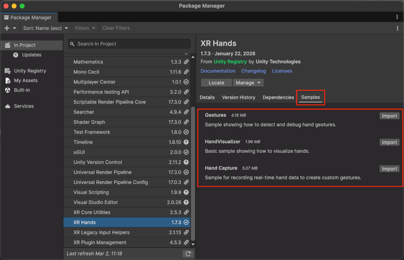
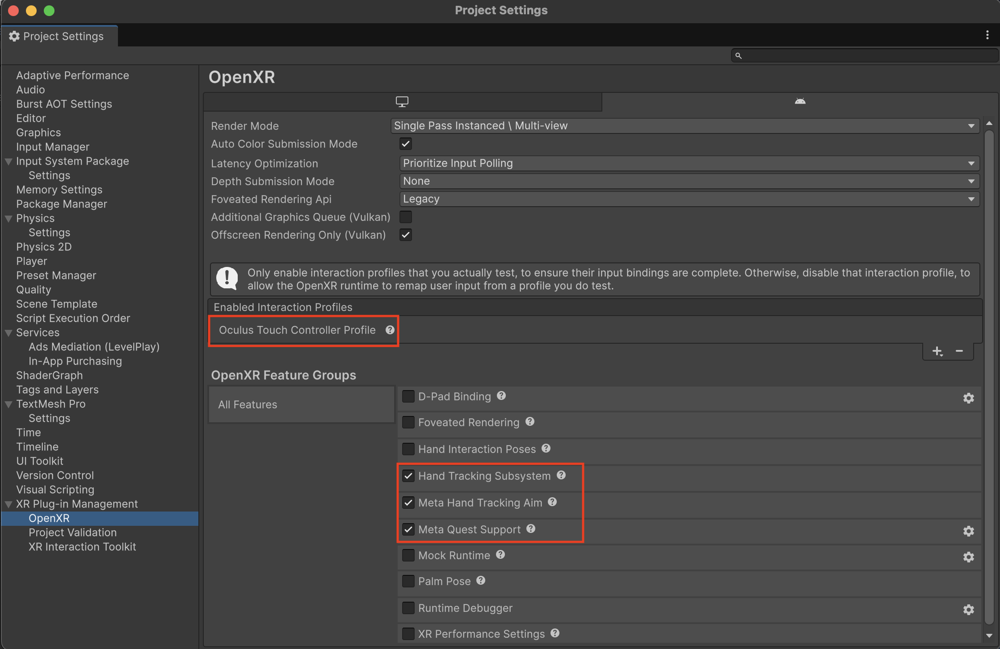

# Scene setup

The quickest way to get started with hand tracking is to use the scene included in the [HandVisualizer sample](xref:xrhands-manual#samples). This sample provides a fully functional hand-tracking scene with hand mesh visualization, debug joints, and all required components already configured.

Import the **HandVisualizer** sample for the XR Hands package using the [Package Manager](https://docs.unity3d.com/Manual/upm-ui-import.html), then open the **HandVisualizer** scene.

 *Import the HandVisualizer sample from the Package Manager*

## Set up a new scene

To add hand tracking to a new scene from scratch, complete the following steps.

### Prerequisites

- [Install XR Hands](xref:xrhands-install).
- [Enable XR providers](xref:xr-configure-providers) for the devices that you plan to support.

### Add an XR Origin

Add an [XR Origin](https://docs.unity3d.com/Packages/com.unity.xr.core-utils@latest?subfolder=/manual/xr-origin.html) to your scene if one doesn't already exist. For VR hand-tracking apps, use the **XR Origin (VR)** provided by the [XR Interaction Toolkit](https://docs.unity3d.com/Packages/com.unity.xr.interaction.toolkit@latest?subfolder=/manual/index.html).

### Add hand visualization

1. Import the **HandVisualizer** sample from XR Hands.
2. In the **Project** window, navigate to **Assets** &gt; **Samples** &gt; **XR Hands** &gt; **&lt;version&gt;** &gt; **HandVisualizer** &gt; **Prefabs**.
3. Drag the **Hand Debug Visualizer** prefab into the **Hierarchy** window as a child of the **Camera Offset** GameObject under the **XR Origin**.
4. Select the **Hand Debug Visualizer** GameObject and make sure its **Transform** position is **(0, 0, 0)** in the **Inspector**.

    > [!IMPORTANT]
    > The Hand Debug Visualizer's local position must be **(0, 0, 0)** relative to the **Camera Offset** GameObject. A non-zero offset causes the rendered hands to be misaligned with the user's real hand positions.

After completing the setup, your **Hierarchy** window should contain the following structure:

* **XR Origin**
    * **Camera Offset**
        * **Main Camera**
        * **Hand Debug Visualizer**

 *Scene hierarchy with XR Origin and Hand Debug Visualizer*

### Enable hand tracking

To enable hand tracking with OpenXR, open **Project Settings** &gt; **XR Plug-in Management** &gt; **OpenXR** and enable **Hand Tracking Subsystem** under **OpenXR Feature Groups**.

For other provider plug-ins, check the documentation for that plug-in for hand-tracking configuration steps.

### Meta Quest support via OpenXR

If building for Meta Quest, you must also enable the [Meta Quest Support](https://docs.unity3d.com/Packages/com.unity.xr.openxr@latest?subfolder=/manual/features/metaquest.html) in the **Android** tab of **Project Settings** &gt; **XR Plug-in Management** &gt; **OpenXR**.

Then add an **Interaction Profile**, such as the [Oculus Touch Controller Profile](https://docs.unity3d.com/Packages/com.unity.xr.openxr@latest?subfolder=/manual/features/oculustouchcontrollerprofile.html), for controller support.

 *OpenXR project settings configured for Meta Quest with hand tracking*

## Additional resources

* [Hand tracking data](xref:xrhands-tracking-data): details about accessing and using hand-tracking data.
* [Custom gestures](xref:xrhands-custom-gestures): information about creating custom gestures for your project.
* [Install XR Hands](xref:xrhands-install): setup and installation instructions.
